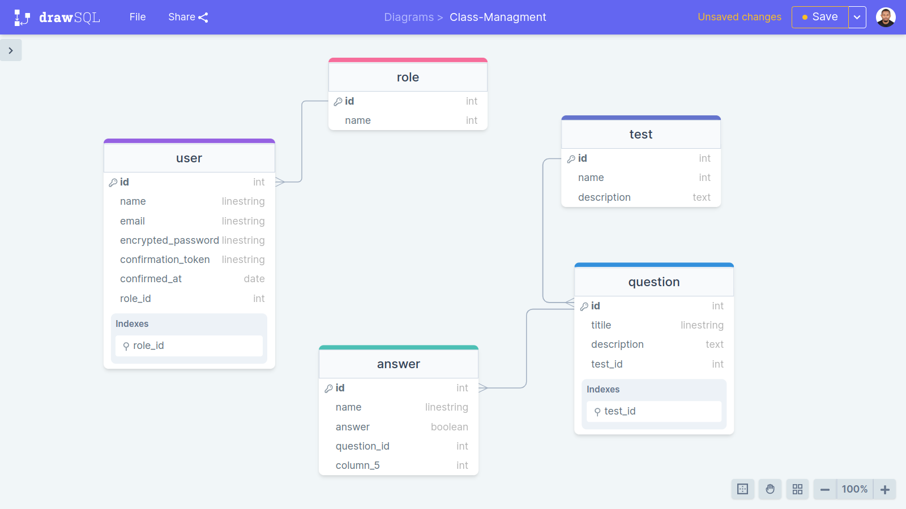
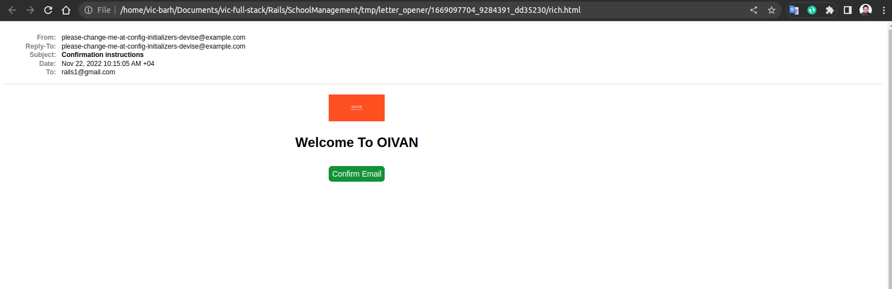
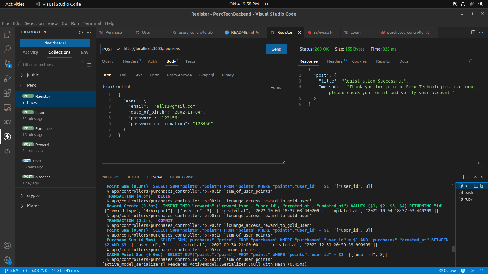
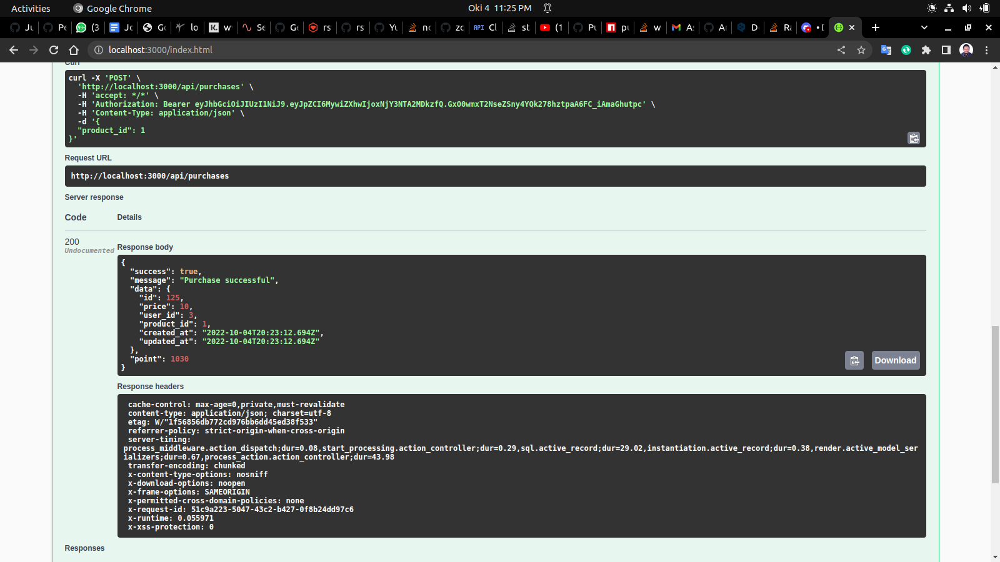

# SCHOOL_MANAGEMENT 

> This is a simple backedn project for class managment where teachers can CRUD a student and assign the test to them as well. studnt will be able to login thourht their credentials generated by the teachers. teacher only teachers can manager the CRUD of the whole app even update the user role to be a teacher. the app has a main teahcer who is by default createdt in the seed of the app. This API is made these models:

  - Role Model
  - User Model
  - Test Model
  - Question mondel 
  - Answer Model
  
### ERD PG

### User confirmation Mailer

### Message rendered from the backend 

### Deployment
 N/A `Kinldy i can't config my google SMTP because i using it to some of my projects that's why i did;\'nt deployed the app on heroku as well`
## Built With

- Rails
- Ruby 
- Postgresql
- Devise
- JWT
- ActiveRecord Serializer
- Sidekiq
- Redis
- Rswag

## Getting Started

Here are the steps to follow in order to get this project on your local computer.

### Prerequisites

`rails v7.0.2 +`

`ruby v3.0.2 +`

### Setup

clone this repo by typing `git clone https://github.com/vic778/`

### Install

install the dependencies by typing `bundle install`

### Usage

start the local server by running `rails s`

### Testing

run the tests by typing `rails rswag`

### Documentation

## Author

👤 **Victor Barh**

- GitHub: [@Vvic778](https://github.com/vic778)
- Twitter: [@victoirBarh](https://twitter.com/)
- LinkedIn: [LinkedIn](https://linkedin.com/in/victoir-barh)

## 🤝 Contributing

Contributions, issues and feature requests are welcome!

Feel free to check the [issues page](issues/).

## Show your support

Give a ⭐️ if you like this project!

## Acknowledgments

 N/A

## 📝 License

This project is [MIT](lic.url) licensed.